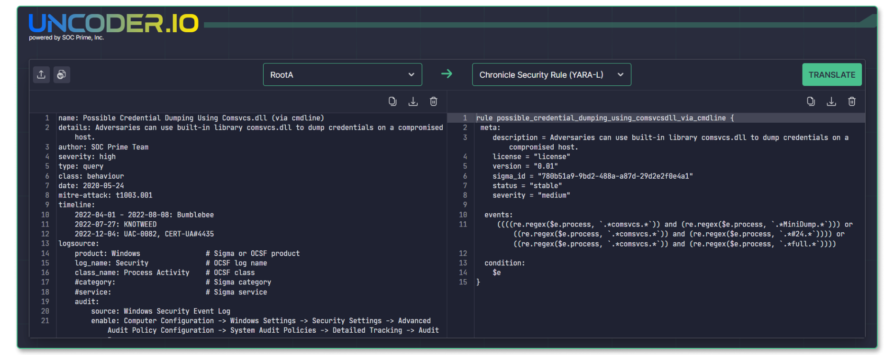

<p align="left">
  
</p>

# What is Uncoder IO
Uncoder IO is a universal open-source tool for cyber defenders acting as an Integrated Development Environment (IDE) for detection engineering. Backed by RootA public domain language and Sigma generic signature format, Uncoder IO enables automated query translation into native SIEM, EDR, XDR, and Data Lake languages and serves as a rule editor supporting MITRE ATT&CK autocompletion and syntax highlighting. Uncoder IO also provides an Indicator of Compromise (IoC) packager for automated query generation based on IoCs parsed from the text input. 



**Table of Contents:**
- [Why Uncoder IO](#why-uncoder-io)
- [Supported Language Formats](#supported-language-formats)
- [Installation](#installation)
- [Online Version](#online-version)
- [How to Use](#how-to-use)
- [How to Contribute](#how-to-contribute)
- [Questions & Feedback](#questions--feedback)
- [Maintainers](#maintainers)
- [Credits](#credits)
- [Licenses](#licenses)
- [Resources & Useful Links](#resources--useful-links)

# :heart_eyes_cat: Why Uncoder IO

## :pretzel: RootA & Sigma Translation Engine

Uncoder IO supports automated translation of RootA and Sigma rules into multiple SIEM, EDR, XDR, and Data Lake formats. Acting as a wrapper for native rules and queries, RootA lets you capture all the native SIEM functions, including aggregations, correlations, and the use of multiple log sources without the need to master the original language. This way, your complex detection logic can be rendered in other languages in an automated fashion. In case a native rule or query contains functions unsupported by RootA or target technology, those functions won’t be translated, with a corresponding note appended to the code translation.

## :pizza: RootA & Sigma Rule Editor

Uncoder IO supports a built-in Sigma and MITRE ATT&CK autocompletion wizard suggesting code enhancements to streamline the rule creation process. 

## :popcorn: IOC Query Generator

Uncoder IO acts as an open-source IOC packager enabling cyber defenders to parse IOCs directly from the chosen text file (threat reports, advisories, etc.) and convert them into performance-optimized IOC queries ready to run in a chosen security analytics platform. 

## :smile_cat: Full Privacy

Uncoder IO ensures 100% privacy with no cookie tracking, no data logging, or sharing with third parties.

# :dna: Supported Language Formats
RootA and Sigma Rules can be translated into the following formats:
- AWS OpenSearch Query - `opensearch-lucene-query`
- AWS Athena Query (Security Lake) - `athena-sql-query`
- Falcon LogScale Query - `logscale-lql-query`
- Falcon LogScale Rule - `logscale-lql-rule`
- Splunk Query - `splunk-spl-query`
- Splunk Alert - `splunk-spl-rule`
- Microsoft Sentinel Query - `sentinel-kql-query`
- Microsoft Sentinel Rule - `sentinel-kql-rule`
- Microsoft Defender for Endpoint Query - `mde-kql-query`
- IBM QRadar Query - `qradar-aql-query`
- CrowdStrike Query - `crowdstrike-spl-query`
- Elasticsearch Query - `elastic-lucene-query`
- Elasticsearch Rule - `elastic-lucene-rule`
- Sigma Rule - `sigma-yml-rule`
- Chronicle Security Query - `chronicle-yaral-query`
- Chronicle Security Rule - `chronicle-yaral-rule`


IOC-based queries can be generated in the following formats:
- Microsoft Sentinel Query - `sentinel-kql-query`
- Microsoft Defender for Endpoint Query - `mde-kql-query`
- Splunk Query - `splunk-spl-query`
- CrowdStrike Query - `crowdstrike-spl-query`
- Elasticsearch Query - `elastic-lucene-query`
- AWS OpenSearch Query - `opensearch-lucene-query`
- Falcon LogScale Query - `logscale-lql-query`
- IBM QRadar Query - `qradar-aql-query`
- AWS Athena Query (Security Lake) - `athena-sql-query`
- Chronicle Security Query - `chronicle-yaral-query`

The following types of IOCs are supported:  
- Hash  
- Domain  
- URL  
- IP  
- Email  
- File  

# :computer: Installation
Uncoder IO is distributed as a Docker package.

## Requirements
* Host with Windows, Linux, or other operating system supported by Docker
* These packages should be installed on the host:
    * Docker v23.0.1 or newer
    * Docker Compose v2.21.0 or newer

## Launch Instructions
1. Download the `UncoderIO-main` archive and unpack it.
2. In the CLI, go to the folder where the unpacked files are:
```
cd UncoderIO-main/
```
3. Run the following command to launch a Docker container:
```
docker-compose up -d
```
4. Open `http://localhost:4010/` in your browser and you are ready to go.

# :evergreen_tree: Online Version
You can use the online open-source version of Uncoder IO at [https://uncoder.io/](https://uncoder.io/). It's free, doesn't require registration, and doesn't collect or store any user data whatsoever.

# :mortar_board: How to Use

## :rocket: Translation
1. Select input type:
    - RootA rule
    - Sigma rule
2. Paste or upload a rule in the selected language into the input panel.
3. Select the output (language, content type, and data schema)
4. Click Translate.

If the input rule cannot be translated, you'll see an error message. When translating a RootA rule, any functions that are not supported in the target language or are not yet supported by Uncoder IO will be listed in the output as a comment.

## :flashlight: IOC-based Query Generation
1. Select IoCs as the input type.
2. Paste or upload text with Indicators of Compromise in the left panel.
3. Make parsing configurations:
    - **Select all:** all listed options are applied
    - **Replace (.) [.] {.} with dot**
    - **Replace hxxp with http**: this functionality is case insensitive, so hXXp, HXXP, HXXp, and hXXP are replaced as well
    - **Exclude Private & Reserved Networks:** private and reserved IP addresses like 224.0.0.0/4 or 127.0.0.0/8 are ignored during IOC recognition
4. Select the output language.
5. Make generation settings:
    - Select what IOC types to use for queries:
        - Hash
        - Domain
        - URL
        - IP
        - Email
        - File
    - Set the number of IOCs per query to take into account the performance of your platform
    - Select what hash types to use for queries if the hash is enabled as an IOC type
    - Set up new or select existing platform-specific IOC field mapping profiles. Use this feature if your data schema has non-standard field names for:
        - Destination IP
        - Source IP
        - Domain
        - URL
        - Emails
        - Files
        - Md5
        - Sha1
        - Sha256
        - Sha512
    - Define exceptions: specify hashes, domains, IPs, emails, files, or URLs (in full or only partially) you want to exclude from your queries
    - Choose if you want to add source IP to your queries with OR operator
6. Click Translate.

## :coffee: Writing rules
Write a RootA or Sigma rule in the input panel. Benefit from code templates, syntax highlighting, autocomplete suggester with MITRE ATT&CK, and other nice little features that improve coding experience.

# :bulb: How to Contribute
Thank you for your interest in the Uncoder IO open-source project! Your contribution really matters in evolving the project and helping us make Uncoder IO even more useful for the global cyber defender community.

To submit your pull request with your ideas or suggestions for changes, take the following steps:

1. Fork the [Uncoder repository](https://github.com/UncoderIO/UncoderIO) and clone your fork to your local environment.
2. Create a new feature branch, in which you’re going to make your changes.
3. Сommit your changes to your newly created feature branch.
4. Push the changes to your fork.
5. Create a new Pull Request  
    a. Clicking the New Pull Request button.  
    b. Select your fork along with a feature branch.  
    c. Provide a title and a description of your changes. Make sure they are both clear and informative.  
    d. Finally, submit your Pull Request and wait for its approval.  

Thank you for your contribution to the Uncoder IO project!

# :mailbox_with_no_mail: Questions & Feedback
Please submit your technical feedback and suggestions to support@socprime.com or the dedicated **Uncoder** channel in [SOC Prime’s Discord](https://discord.gg/socprime). Also, refer to the [guidance for contributors](#how-to-contribute) to support the Uncoder IO project or simply [report issues](https://github.com/UncoderIO/UncoderIO/issues).

# :wrench: Maintainers
Since 2018, the SOC Prime team has been developing Uncoder from the ground up. The first steps were our support of Sigma rules and the Uncoder IO project, an online yet fully private IDE for detection engineering. Now, the SOC Prime Team shares Uncoder IO as an open-source project.

Uncoder IO project is maintained by SOC Prime, and while any suggestions and reported issues are welcome.

# :kissing_heart: Credits
We are genuinely grateful to security professionals who contribute their time, expertise, and creativity to evolve the Uncoder open-source project.

# :briefcase: Licenses
Please see [LICENSE](https://github.com/UncoderIO/UncoderIO/blob/main/LICENSE/) for details on the Uncoder IO licensing.

# :book: Resources & Useful Links
[Uncoder IO](https://uncoder.io/) - free online translation engine for RootA, Sigma, and IOC-based queries  
[Uncoder AI](https://tdm.socprime.com/uncoder-ai) - SaaS version of Uncoder acting as advanced IDE for detection engineering  
[RootA.IO](https://roota.io/) - the main website page of the single language for threat detection & response  
[SOC Prime Platform](https://tdm.socprime.com/login) - the industry-first platform for collective cyber defense  
[About SOC Prime](https://socprime.com/) - learn more about SOC Prime and its mission
