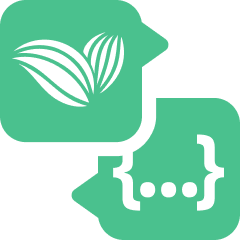
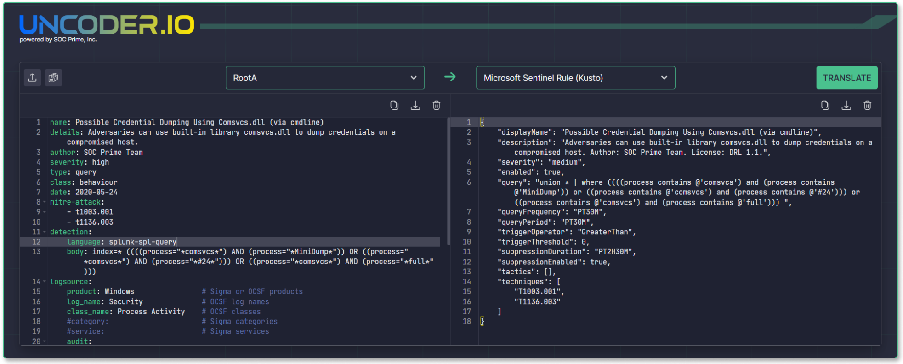

<p align="left">
  
</p>

# Що таке Uncoder IO (публічна бета-версія)

:earth_americas: [English](README.md)  [Українська](README_Ukrainian.md)

Uncoder IO є опенсорсною версією SaaS-інструменту https://uncoder.io та Uncoder AI, другого пілоту для фахівців з кібербезпеки. Uncoder IO – це швидкий та простий у використанні онлайн-перекладач для Sigma-правил, який працює з 2018 року, забезпечуючи користувачам 100% конфіденційності. Опенсорсний Uncoder IO має такі сценарії використання:
- Переклад правил, написаних на Sigma, стандартизованому форматі для SIEM-систем, на нативні мови різних SIEM, EDR чи Data Lake.
- Пакування індикаторів компрометації з будь-якого небінарного формату, як-то PDF, текстового, STIX чи OpenIOC, у запити нативними мовами різних SIEM, EDR чи Data Lake.
- Переклад правил, написаних на Roota, новій вільно розповсюджуваній мові для колективного кіберзахисту, на нативні мови різних SIEM, EDR чи Data Lake.

Uncoder розроблено командою спеціалістів з Detection Engineering, спеціалістів з Threat Hunting та CTI-аналітиків з України, Європи, США, Аргентини та Австралії. Цей інструмент покликаний допомогти фахівцям з кібербезпеки працювати краще та швидше на роботі та в хобі-проєктах, а також легко ділитися результатами для покращення колективного кіберзахисту.

 

**Зміст:**
- [Ключові переваги Uncoder IO](#heart_eyes_cat-ключові-переваги-uncoder-io)
- [Підтримка мовних форматів](#dna-підтримка-мовних-форматів)
- [Встановлення](#computer-встановлення)
- [Як користуватися](#mortar_board-як-користуватися)
- [Як долучитися до проєкту](#bulb-як-долучитися-до-проєкту)
- [Питання та відгуки](#mailbox_with_no_mail-питання-та-відгуки)
- [Хто веде проєет](#wrench-хто-веде-проєкт)
- [Учасники](#kissing_heart-учасники)
- [Ліцензії](#briefcase-ліцензії)
- [Ресурси та корисні посилання](#book-ресурси-та-корисні-посилання)

# :heart_eyes_cat: Ключові переваги Uncoder IO

## :pretzel: Перекладач правил на Roota й Sigma

Uncoder IO підтримує автоматичний переклад правил, написаних на Roota й Sigma, на нативні мови різних систем SIEM, EDR, XDR та Data Lake. 
 - **Sigma** – це відкритий універсальний формат сігнатур, який дає змогу просто та зрозуміло описувати потрібні події в логах. Згідно зі статистикою SOC Prime з перекладу та завантаження контенту, мовою Sigmа користуються експерти у галузі кібербезпеки з більше ніж 8000 організацій та 155 країн.

- **Roota** – це мова з відкритим кодом, що підтримує запити нативними мовами SIEM-систем, синтаксис кореляції, який не залежить від вендора, а також автодоповнення коду за фреймворком MITRE ATT&CK 14.0 та автодоповнення джерел логів на основі формату OCSF від Amazon чи мови Sigma. Поєднання Roota та Uncoder є першим кроком до повної сумісності різних мов кібербезпеки, щоб одного дня фахівці, які знають певну нативну мову запитів (як-то SPL чи KQL) або універсальну мову (Roota чи Sigma), могли однаково добре користуватися всіма мовами кібербезпеки. Таким чином, складну логіку детектування загроз можна автоматично відтворити іншими мовами. У разі якщо нативне правило або запит містять функції, що не підтримуються мовою Roota або цільовою технологією, ці функції не будуть перекладені, а код перекладу буде доповнено відповідним коментарем. Це дозволяє експертам або самостійно вручну закінчити переклад, якщо вони знають мови перекладу та оригіналу, або застосувати Uncoder AI для ручної обробки подібних сценаріїв. Обмінюватися знаннями за допомогою Sigma було легко, Roota ж робить цей процес абсолютно природним – як зараз, так і в майбутньому.

## :pizza: Редактор коду для Rootа та Sigma 

Uncoder IO має вбудований функціонал автодоповнення коду для правил Rootа та Sigma на основі останньої версії MITRE ATT&CK та словників джерел логів, що спрощує та пришвидшує процес написання правил. Будь-яка з трьох версій Uncoder полегшує написання коду.

## :popcorn: Генератор запитів на основі індикаторів компрометації

Uncoder IO працює як пакувальник індикаторів компрометації. За його допомогою CTI- та SOC-аналітики, а також фахівці з Threat Hunting можуть швидко розпарсити будь-яку кількість індикаторів компрометації з будь-якого цифрового небінарного формату (простого скопіювавши та вставився вебсторінку, завантаживши CSV, OpenIOC, PDF, STIX, тощо) та конвертувати їх в запити, оптимізовані для підвищення продуктивності, які можна зразу запустити у відповідній системі. Оскільки поширення індикаторів компрометації регулюється протоколом TLP, не рекомендується поширювати їх у виді правил Sigma чи Roota, оскільки останні не відносяться до аналітичної інформації про загрози та, відповідно, не мають обмежень на поширення. Однак, для галузі кібербезпеки потрібні як поведінкові сигнатури, так і індикатори компрометації, тож Uncoder IO створений, щоб допомагати у легкому вирішенні обох задач. 

## :smile_cat: Повна конфіденційність

Uncoder IO може працювати локально без потреби в інтернет-з'єднанні, що дозволяє використовувати його у фізично ізольованих мережах. Тим не менш, ми рекомендуємо регулярно перевіряти наявність апдейтів та встановлювати їх. SaaS-версія продукту забезпечує 100% конфіденційності: в ній не використовуються cookies, не відстежуються дані або код і нічого не передається третім сторонам. Навіть використовуючи функціоність Uncoder AI, ви зберігаєте повний контроль над даними та кодом.

# :dna: Підтримка мовних форматів
Правила на Roota та Sigma можна перекласти в такі формати:
- AWS OpenSearch Query - `opensearch-lucene-query`
- AWS Athena Query (Security Lake) - `athena-sql-query`
- Falcon LogScale Query - `logscale-lql-query`
- Falcon LogScale Rule - `logscale-lql-rule`
- Splunk Query - `splunk-spl-query`
- Splunk Alert - `splunk-spl-rule`
- Microsoft Sentinel Query - `sentinel-kql-query`
- Microsoft Sentinel Rule - `sentinel-kql-rule`
- Microsoft Defender for Endpoint Query - `mde-kql-query`
- IBM QRadar Query - `qradar-aql-query`
- CrowdStrike Query - `crowdstrike-spl-query`
- Elasticsearch Query - `elastic-lucene-query`
- Elasticsearch Rule - `elastic-lucene-rule`
- ElastAlert Rule - `elastalert-lucene-rule`
- Sigma Rule - `sigma-yml-rule`
- Chronicle Security Query - `chronicle-yaral-query`
- Chronicle Security Rule - `chronicle-yaral-rule`
- Graylog Query - `graylog-lucene-query`

Запити на основі індикаторів компрометації можна генерувати в таких форматах:
- Microsoft Sentinel Query - `sentinel-kql-query`
- Microsoft Defender for Endpoint Query - `mde-kql-query`
- Splunk Query - `splunk-spl-query`
- CrowdStrike Endpoint Security Query - `crowdstrike-spl-query`
- Elastic Stack Query - `elastic-lucene-query`
- AWS OpenSearch Query - `opensearch-lucene-query`
- Falcon LogScale Query - `logscale-lql-query`
- IBM QRadar Query - `qradar-aql-query`
- AWS Athena Query (Security Lake) - `athena-sql-query`
- Chronicle Security Query - `chronicle-yaral-query`
- ArcSight Query - `arcsight`
- FireEye Query - `fireeye_helix`
- Graylog Query - `graylog-lucene-query`
- Logpoint Query - `logpoint`
- Qualys IOC Query - `qualys`
- RSA NetWitness Query - `rsa_netwitness`
- Securonix Query - `securonix`
- SentinelOne Query (Events) - `s1-events`
- Snowflake Query - `snowflake`
- Sumo Logic Query - `sumologic`
- VMware Carbon Black Query (Cloud) - `carbonblack`

Підтримуються такі типи індикаторів компрометації:  
- Хеші  
- Домени 
- URL-адреси  
- IP-адреси   

Найближчим часом планується підтримка таких форматів:
- LogRhythm Axon  
- ~~Graylog~~ :white_check_mark:
- Devo
- LimaCharlie
- Sumo Logic
- Sumo Logic CSE
- ArcSight
- Databricks
- Cribl
- FortiSIEM
- Exabeam
- Palo Alto Cortex XSOAR
- ~~ElastAlert~~ :white_check_mark:
- FireEye OpenIOC
- SentinelOne
- Datadog
- FireEye Helix
- Logpoint
- RSA NetWitness
- PowerShell
- Snowflake
- SQL
- VMware Carbon Black
- Apache Kafka ksqlDB
- HawkSearch
- Regex Grep
- Logiq
- Qualys
- Securonix
- STIX
- StreamAlert
- Sysmon
- UberAgent ESA

# :computer: Встановлення
Uncoder IO можна встановити в один із таких способів:
  1. Docker-контейнер з вебсервером та UI-інтерфейсом [Інструкція із запуску Docker-контейнеру](#launch-instructions-for-docker-container)
  2. Docker-контейнер з API та CLI-інтерфейсом (у процесі розробки)
  3. Збірка безпосередньо з вихідного коду (для досвідчених користувачів; виконується на основі інструкцій з файлів Docker)
  4. Готова до використання SaaS-версія із забезпеченням конфіденційності, без cookie та без реєстрації: [https://uncoder.io/](https://uncoder.io/)
  5. Готова до використання версія на SaaS-платформі SOC Prime з конфіденційним збагаченням даними з використанням AI, сертифікацією SOC 2 Type II, Умовами використання, що регулюють конфіденційність даних, дотриманням GDPR, тощо: [https://tdm.socprime.com/uncoder-ai](https://tdm.socprime.com/uncoder-ai)

Нижче викладено вимоги та інструкції із запуску Docker-контейнера з вебсервером та UI-інтерфейсом.

## Вимоги до Docker-контейнера
* Хост із Windows, Linux або іншою операційною системою, яку підтримує Docker.
* На хості мають бути встановлені такі пакети:
    * Docker v23.0.1 чи новішої версії
    * Docker Compose v2.21.0 чи новішої версії.

## Інструкція із запуску Docker-контейнера
1. Завантажте й розпакуйте архів `UncoderIO-main`.
2. Використовуючи консоль (командний рядок), перейдіть до папки з розпакованими файлами:
```
cd UncoderIO-main/
```
3. Виконайте цю команду для запуску Docker-контейнера:
```
docker-compose up -d
```
4. Відкрийте `http://localhost:4010/` у браузері для початку роботи.

# :mortar_board: Як користуватися

## :rocket: Переклад
1. Виберіть формат оригіналу:
    - Roota
    - Sigma
2. Вставте або завантажте правило у вибраному форматі до панелі введення зліва.
3. Виберіть формат перекладу (мову, тип контенту та схему даних).
4. Натисніть кнопку Translate.

Якщо оригінал правила неможливо перекласти, з’явиться повідомлення про помилку. У разі перекладу правил Roota будь-які функції, що не підтримує цільова мова або Uncoder IO, будуть перелічені в коментарі на панелі з результатами перекладу.

## :flashlight: Генерація запитів на основі індикаторів компрометації
1. Виберіть IoCs (індикатори компрометації) як формат оригіналу.
2. Вставте або завантажте текст з індикаторами компрометації до панелі введення зліва.
3. Виберіть налаштування парсингу:
    - **Select all:** – застосувати всіх перераховані опції
    - **Replace (.) [.] {.} with dot** – замінити (.) [.] {.} на крапку
    - **Replace hxxp with http** – замінити hxxp на http. Зверність увагу, що ця функціональність не чутлива до регістру, тому hXXp, HXXP, HXXp та hXXP будуть також замінені
    - **Exclude Private & Reserved Networks:** – ігнорувати під час визначення індикаторів компрометації приватні та зарезервовані IP-адреси на кшталт 224.0.0.0/4 чи 127.0.0.0/8
4. Оберіть мову, якою потрібно згенерувати запити.
5. Встановіть налаштування для генерації запиту:
    - Виберіть, які типи індикаторів компрометації включати в запити:
        - Хеші
        - Домени
        - URL-адреси
        - IP-адреси
    - Встановіть кількість індикаторів компрометації на запит з урахуванням продуктивності вашої платформи.
    - Зазначте виключення: хеші, домени, IP-адреси чи URL-адреси (повністю або частково), які ви хочете не враховувати у генерації запиту.
6. Натисніть кнопку Translate.

## :coffee: Написання правил
Пишіть правила Roota чи Sigma прямо у панелі введення зліва. Використовуйте шаблони коду, підсвічування синтаксису, функцію автодоповнення із підказками на основі MITRE ATT&CK та інші приємні переваги Uncoder IO, щоб полегшити та пришвидшити роботу з кодом.

# :bulb: Як долучитися до проєкту
Дякуємо за інтерес до відкритого проєкту Uncoder IO! Ми вдячні кожному, хто допомагає розвивати цей проєкт і робити Uncoder IO ще більш корисним для глобальної спільноти спеціалістів з кіберзахисту.

Щоб зробити пул-реквест з ідеями або пропозиціями, виконайте такі дії:

1. Зробіть форк [репозиторія Uncoder](https://github.com/UncoderIO/UncoderIO) і створіть його локальну копію.
2. Створіть гілку, в якій ви вноситимете зміни.
3. Зробіть коміт зі внесеними змінами в створену вами гілку.
4. Відправте зміни у свій форк.
5. Створіть новий пул-реквест. 
    a. Натисніть кнопку New Pull Request (Новий пул-реквест).  
    b. Виберіть свій форк з гілкою, яка містить зміни.  
    c. Зазначте назву та опис змін. Вони мають бути чіткими й інформативними.  
    d. Відправте пул-реквест і очікуйте на його схвалення.  

Дякуємо за ваш внесок в проєкт Uncoder IO!

# :mailbox_with_no_mail: Питання та відгуки
Відправляйте ваші технічні відгуки чи пропозиції на адресу support@socprime.com або у спеціальному каналі **Uncoder** у нашій спільноті на [Discord](https://discord.gg/socprime). Також ви можете переглянути [інструкцію, як долучитися до проєкту](#how-to-contribute) для підтримки Uncoder IO або просто [повідомити про баги](https://github.com/UncoderIO/UncoderIO/issues).

# :wrench: Хто веде проєкт
Команда SOC Prime розвиває проєкт Uncoder починаючи з 2018 року. Першими кроками були підтримка правил Sigma та проєкт Uncoder IO, інтегроване середовище розробки (IDE) для Detection Engineering, доступне онлайн з повним збереженням конфіденційності. Тепер команда SOC Prime виклала Uncoder IO як проєкт з відкритим вихідним кодом.

Проєкт Uncoder IO підтримується командою SOC Prime. Ми вдячні за будь-які пропозиції та повідомлення про баги, але наголошуємо, що фінальне рішення щодо схвалення або відхилення будь-якого пул-реквесту залишається за командою розробників SOC Prime.

# :kissing_heart: Учасники

Ми щиро вдячні всім спеціалістам з кіберзахисту, які застосовують свої знання, проявляють кмітливість і докладають час для розвитку відкритого проєкту Uncoder IO.

# :briefcase: Ліцензії
Безкоштовна версія Uncoder IO (Uncoder IO Community Edition) випущена під ліцензією Apache 2.0. Функції платної версії Uncoder IO (Commercial Edition), за умови, що вони були випущені у відкритому доступі, можуть бути доступними не на комерційній основі для користувачів, що не мають преміальної  підписки SOC Prime. Права на комерційне використання доповнюють ліцензію, що діє для SOC Prime SaaS-платформи. Дивіться файл [ЛІЦЕНЗІЯ](https://github.com/UncoderIO/UncoderIO/blob/main/LICENSE/) для отримання більш детальної інформації щодо ліцензування Uncoder IO.

# :book: Ресурси та корисні посилання
[Uncoder IO](https://uncoder.io/) – безкоштовний онлайн-перекладач правил Roota та Sigma, а також генератор запитів на основі індикаторів компрометації (IOC)  
[Uncoder AI](https://tdm.socprime.com/uncoder-ai) – SaaS-версія Uncoder, що функціонує як інтегроване середовище розробки (IDE) для Detection Engineering  
[Roota.IO](https://roota.io/) – основна вебсторінка проєкту Roota, універсальної мови для детектування загроз та реагування  
[SOC Prime Platform](https://tdm.socprime.com/login) – перша в індустрії платформа для побудови колективного кіберзахисту  
[About SOC Prime](https://socprime.com/) – більше інформації про SOC Prime та місію компанії
